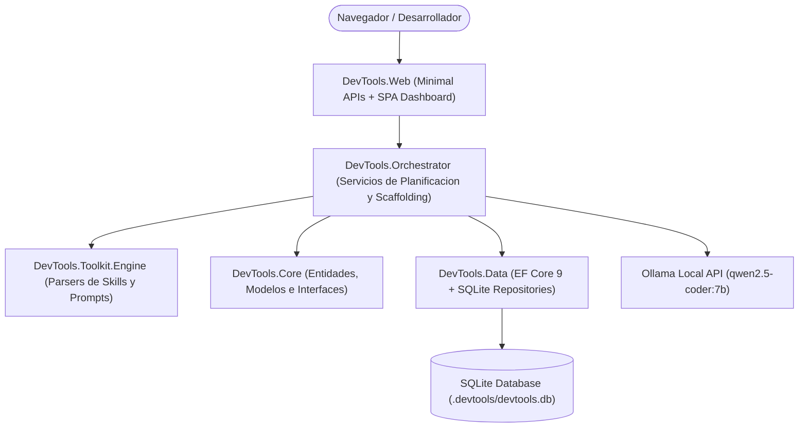

# AI DevTools Studio

> Plataforma de ingenieria de software asistida por IA para planificacion arquitectonica, scaffolding fisico en .NET 9 Clean Architecture, generacion de directrices para Google Antigravity y evaluacion de calidad ISO/IEC 25010.

---

## Tabla de Contenidos

- [Vision General](#vision-general)
- [Arquitectura de la Solucion](#arquitectura-de-la-solucion)
- [Caracteristicas Principales](#caracteristicas-principales)
- [Stack Tecnologico](#stack-tecnologico)
- [Estructura del Repositorio](#estructura-del-repositorio)
- [Prerrequisitos](#prerrequisitos)
- [Instalacion y Configuracion](#instalacion-y-configuracion)
- [Ejecucion](#ejecucion)
- [Endpoints de la API](#endpoints-de-la-api)
- [Generacion de Documentacion para Antigravity](#generacion-de-documentacion-para-antigravity)
- [Evaluacion de Calidad (ISO/IEC 25010)](#evaluacion-de-calidad-isoiec-25010)
- [Pruebas Automatizadas](#pruebas-automatizadas)
- [Licencia](#licencia)

---

## Vision General

**AI DevTools Studio** es una plataforma disenada para acelerar el ciclo de vida del desarrollo de software mediante agentes inteligentes. Integra un modelo de lenguaje local (Ollama `qwen2.5-coder:7b`) con motores de heuristica arquitectonica para dialogar con el ingeniero de software, refinar requerimientos tecnicos, disenar diagramas C4 y estructurar soluciones compilables de nivel empresarial.

La plataforma no solo genera planos teoricos, sino que materializa soluciones completas en disco con proyectos independientes, inyeccion de dependencias, pruebas unitarias, especificacion multi-contenedor Docker y directrices formales para agentes de codificacion autonomos como Google Antigravity.

---

## Arquitectura de la Solucion

El sistema implementa una arquitectura modular desacoplada basada en Clean Architecture sobre .NET 9:



### Flujo de Dependencias Unidireccional
1. **`DevTools.Core`**: Nucleo puro sin dependencias externas hacia bases de datos o frameworks web. Contiene contratos, entidades y modelos de transferencia.
2. **`DevTools.Data`**: Capa de persistencia relacional con Entity Framework Core 9 para SQLite, con inicializador automatico y repositorios tipados.
3. **`DevTools.Toolkit.Engine`**: Motor de lectura y parseo de frontmatter Markdown y configuraciones JSON para skills y prompts.
4. **`DevTools.Orchestrator`**: Capa de coordinacion de agentes. Gestiona el bucle de conversacion inteligente, el streaming SSE, la ejecucion de acciones CRUD y la generacion fisica de archivos en disco o ZIP.
5. **`DevTools.Web`**: Capa de exposicion REST y Single Page Application desarrollada en HTML5/CSS Vanilla de alto rendimiento.

---

## Caracteristicas Principales

### 1. Asistente Inteligente con Streaming en Tiempo Real
- Comunicacion fluida token a token mediante Server-Sent Events (SSE).
- Aislamiento total de sesiones por proyecto con marcas de tiempo relativas en UTC.
- Capacidades ejecutivas (CRUD): renombrar proyectos, modificar el stack tecnologico, agregar/eliminar convenciones y generar artefactos directamente desde el chat.

### 2. Scaffolding Fisico Compilable en .NET 9
Genera soluciones completas en disco o en paquetes comprimidos `.zip` con la siguiente estructura:
- Archivo de solucion `.sln` para Visual Studio / Rider / .NET CLI.
- Proyectos por capas: `Domain`, `Application`, `Infrastructure`, `Api` y `UnitTests`.
- Docker Compose multi-contenedor con perfiles para PostgreSQL, CockroachDB, Redis y Apache Kafka.
- Configuraciones de calidad: `.editorconfig`, `.gitignore` y multi-stage `Dockerfile`.

### 3. Generacion de Directrices para Google Antigravity
- Generacion automatica de `AGENTS.md` y `.agents/AGENTS.md` conteniendo directivas de aislamiento de capas, pureza del dominio, estandares C# 13, comandos de verificacion CLI y directiva de cero emojis.

### 4. Bucle de Feedback de Calidad (ISO/IEC 25010)
- Evaluacion automatica de los requisitos contra los pilares del estandar ISO/IEC 25010: adecuacion funcional, confiabilidad, seguridad, eficiencia de desempeno, mantenibilidad y portabilidad.
- Generacion de preguntas tecnicas para resolver ambiguedades antes de la fase de codificacion.

### 5. Estudio Visual de Arquitectura y Preview de Tokens
- Renderizado interactivo de diagramas C4 a nivel de contenedores en sintaxis Mermaid.
- Previsualizacion en vivo de componentes UI (botones, tarjetas KPI, badges) alimentados por tokens CSS de diseno.
- Auditor de codigo con analisis estatico preliminar basado en directivas OWASP y Clean Code.

---

## Stack Tecnologico

| Componente | Tecnologia |
| :--- | :--- |
| **Runtime & Lenguaje** | .NET 9.0 SDK, C# 13 |
| **Persistencia** | Entity Framework Core 9, SQLite |
| **Modelo de IA Local** | Ollama (`qwen2.5-coder:7b`) via API HTTP |
| **Streaming** | Server-Sent Events (SSE) con `IAsyncEnumerable` |
| **Frontend** | Vanilla HTML5 / Modern CSS (Design Tokens Slate) / JavaScript ES2022 |
| **Diagramacion** | Mermaid.js nativo |
| **Testing** | xUnit, FluentAssertions, Microsoft.NET.Test.Sdk |
| **Contenedores** | Docker, Docker Compose |

---

## Estructura del Repositorio

```text
DevTools/
├── .devtools/                     # Directorio de datos locales SQLite
├── src/
│   ├── DevTools.Core/             # Interfaces, modelos y entidades de dominio
│   ├── DevTools.Data/             # Contexto EF Core y repositorios SQLite
│   ├── DevTools.Toolkit.Engine/   # Parsers de skills, prompts y frontmatter
│   ├── DevTools.Orchestrator/     # Servicios de planificacion, chat y scaffolding
│   └── DevTools.Web/              # Minimal APIs, dashboard SPA y endpoints
├── tests/
│   └── DevTools.Toolkit.Tests/    # Suite de pruebas unitarias e integradas
├── toolkit/
│   ├── prompts/                   # Catalogo de prompts estructurados
│   └── skills/                    # Catalogo de skills y herramientas
├── .editorconfig                  # Reglas de estilo de codigo
├── .gitignore                     # Exclusion de binarios y temporales
├── DevTools.sln                   # Solucion global de Visual Studio
└── README.md                      # Documentacion general del proyecto
```

---

## Prerrequisitos

- [.NET 9.0 SDK](https://dotnet.microsoft.com/download/dotnet/9.0) (version 9.0.100 o superior).
- [Ollama](https://ollama.com/) (opcional pero recomendado para generacion con LLM local).
  - Modelo recomendado: `ollama run qwen2.5-coder:7b`.
- [Docker Desktop](https://www.docker.com/products/docker-desktop/) (opcional, para servicios de contenedores de las soluciones generadas).

---

## Instalacion y Configuracion

1. Clonar el repositorio:
   ```bash
   git clone https://github.com/MarcosGHernandez/Devtools_MH011.git
   cd Devtools_MH011
   ```

2. Restaurar dependencias de la solucion:
   ```bash
   dotnet restore DevTools.sln
   ```

3. Verificar la configuracion de Ollama en `src/DevTools.Web/appsettings.json` o `devtools.config.json`:
   ```json
   {
     "Ollama": {
       "Endpoint": "http://localhost:11434",
       "Model": "qwen2.5-coder:7b"
     }
   }
   ```

---

## Ejecucion

### Iniciar la Plataforma Web

Ejecutar la aplicacion web en el puerto predeterminado 5059:

```bash
dotnet run --project src/DevTools.Web/DevTools.Web.csproj --urls "http://localhost:5059"
```

Abrir en el navegador: [http://localhost:5059](http://localhost:5059)

---

## Endpoints de la API

### Gestion de Proyectos y Planificacion
- `GET /api/planning/projects`: Lista de todos los proyectos registrados con metadata y resumen de mensajes.
- `GET /api/planning/projects/{id}`: Detalle de un proyecto y su ultimo blueprint arquitectonico.
- `PUT /api/planning/projects/{id}`: Actualizacion de datos de identificacion del proyecto.
- `DELETE /api/planning/projects/{id}`: Eliminacion completa del proyecto y sus artefactos.
- `GET /api/planning/projects/{id}/messages`: Historial cronologico de conversacion.
- `DELETE /api/planning/projects/{id}/messages`: Reinicio del historial de chat manteniendo el blueprint.

### Asistente y Streaming
- `POST /api/planning/chat`: Procesamiento de turno de conversacion síncrono.
- `POST /api/planning/chat/stream`: Transmision de tokens y acciones en tiempo real via Server-Sent Events.

### Exportacion y Scaffolding
- `POST /api/planning/projects/{id}/scaffold`: Generacion fisica de la solucion en una ruta de disco local.
- `GET /api/planning/projects/{id}/export-zip`: Descarga de la solucion completa en archivo `.zip`.
- `GET /api/planning/projects/{id}/export-docs`: Descarga de documentacion tecnica y diagrama C4 en Markdown.
- `GET /api/planning/projects/{id}/export-agents`: Descarga de la guia formal `AGENTS.md` para Google Antigravity.

---

## Generacion de Documentacion para Antigravity

El archivo `AGENTS.md` generado por AI DevTools Studio provee a los agentes de codificacion las reglas indispensables para operar sobre el repositorio sin degradar la arquitectura:

- **Estructura de Capas**: Delimitacion de responsabilidades entre `Domain`, `Application`, `Infrastructure` y `Api`.
- **Estandares de Codificacion**: C# 13 idiomático, nullable reference types y Result pattern para control de errores de negocio.
- **Comandos de Verificacion**:
  ```bash
  # Compilar solucion completa
  dotnet build <ProjectName>.sln

  # Ejecutar suite de pruebas unitarias
  dotnet test --nologo

  # Levantar infraestructura en Docker
  docker compose up -d

  # Ejecutar la API en desarrollo
  dotnet run --project src/<ProjectName>.Api/<ProjectName>.Api.csproj
  ```

---

## Evaluacion de Calidad (ISO/IEC 25010)

El motor de planificacion integra un diagnostico continuo contra los criterios de calidad de software:

1. **Adecuacion Funcional**: Cobertura de casos de uso principales, reglas de negocio y flujos alternativos.
2. **Confiabilidad**: Tolerancia a fallos, reintentos idempotentes y consistencia en la persistencia relacional.
3. **Seguridad**: Autenticacion JWT/OAuth2, autorizacion basada en roles (RBAC) y proteccion de endpoints.
4. **Eficiencia de Desempeno**: Estrategia de cache distribuido con Redis y consultas optimizadas en base de datos.
5. **Mantenibilidad**: Alta cohesion, bajo acoplamiento y cobertura de pruebas unitarias.
6. **Portabilidad**: Contenedores estandarizados y ejecucion multiplataforma.

---

## Pruebas Automatizadas

La solucion cuenta con una suite automatizada de pruebas unitarias e integradas con xUnit y FluentAssertions:

```bash
dotnet test --nologo
```

Para ejecucion rapida en pipelines de integracion continua excluyendo la compilacion fisica pesada en disco:
```bash
dotnet test --nologo --filter "FullyQualifiedName!~ScaffoldProject_Should_CompileWithDotnetBuild"
```

---

## Licencia

Este proyecto se distribuye bajo los terminos de la licencia MIT. Consulta el archivo correspondiente para mas detalles.
