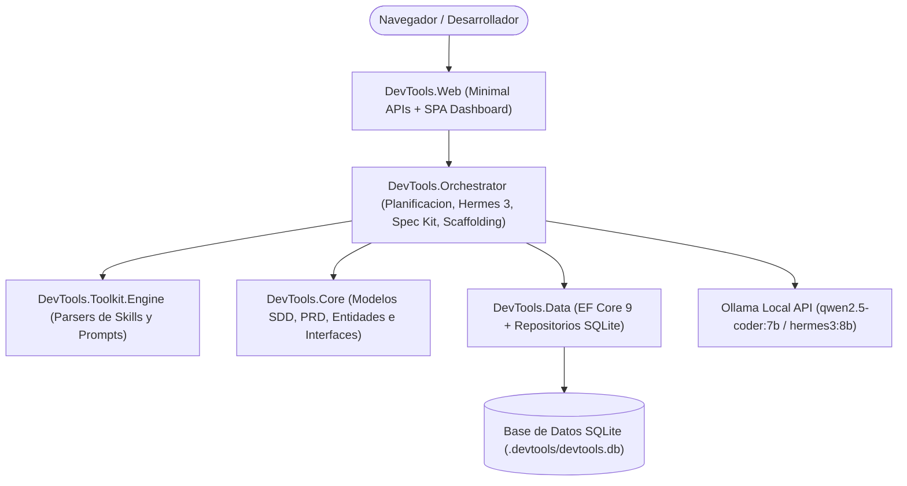

# AI DevTools Studio

> Plataforma de ingenieria de software asistida por IA para planificacion arquitectonica, integracion del estandar GitHub Spec Kit (Spec-Driven Development), generacion de PRDs empresariales, directivas avanzadas AGENTS.md, scaffolding compilable en .NET 9 Clean Architecture y evaluacion de calidad bajo la norma ISO/IEC 25010.

---

## Tabla de Contenidos

- [Vision General](#vision-general)
- [Arquitectura de la Solucion](#arquitectura-de-la-solucion)
- [Estandar GitHub Spec Kit (SDD)](#estandar-github-spec-kit-sdd)
- [Generador de PRDs y Documentacion Empresarial](#generador-de-prds-y-documentacion-empresarial)
- [Motor de Razonamiento Cognitivo y Mejora Continua (Hermes 3)](#motor-de-razonamiento-cognitivo-y-mejora-continua-hermes-3)
- [Ingesta y Analisis de Documentos en el Chat](#ingesta-y-analisis-de-documentos-en-el-chat)
- [Capacidades CRUD del Agente](#capacidades-crud-del-agente)
- [Caracteristicas Principales](#caracteristicas-principales)
- [Stack Tecnologico](#stack-tecnologico)
- [Estructura del Repositorio](#estructura-del-repositorio)
- [Prerrequisitos](#prerrequisitos)
- [Instalacion y Configuracion](#instalacion-y-configuracion)
- [Ejecucion](#ejecucion)
- [Endpoints de la API](#endpoints-de-la-api)
- [Directivas AGENTS.md para Asistentes de IA](#directivas-agentsmd-para-asistentes-de-ia)
- [Evaluacion de Calidad (ISO/IEC 25010)](#evaluacion-de-calidad-isoiec-25010)
- [Pruebas Automatizadas](#pruebas-automatizadas)
- [Licencia](#licencia)

---

## Vision General

**AI DevTools Studio** es una plataforma integral de ingenieria de software disenada para asistir a desarrolladores y arquitectos en todo el ciclo de diseno, especificacion y construccion de sistemas. Integra modelos de lenguaje locales (Ollama con soporte para `qwen2.5-coder:7b` y `hermes3:8b` con scratchpad `<thought>`) junto con motores de heuristicas arquitectonicas de Clean Architecture sobre .NET 9.

A diferencia de generadores de codigo genericos, AI DevTools Studio implementa la metodologia **Spec-Driven Development (SDD)** mediante el estandar **GitHub Spec Kit**, asegurando que ningun componente sea programado sin contar previamente con especificaciones formales, invariantes de dominio, compuertas de decision (*Decision Gates*) y tareas cuantificables.

La plataforma no solo genera planos y diagramas teoricos: materializa soluciones fisicas completas compilables en disco (`dotnet build` con 0 advertencias), con proyectos desacoplados, persistencia relacional con EF Core 9, contenedores Docker, suite de pruebas con xUnit y FluentAssertions, y un conjunto documental completo que incluye PRDs, ADRs, recomendaciones tecnicas y directivas formales para agentes de IA.

---

## Arquitectura de la Solucion

El sistema implementa una arquitectura desacoplada basada en Clean Architecture sobre .NET 9:



### Principios de Diseno y Capas

1. **`DevTools.Core`**: Capa de dominio pura sin dependencias hacia frameworks externos ni bases de datos. Define los modelos del estandar Spec Kit (`SpecKitSpec`, `SpecKitFile`), modelos de documentacion (`ArchitectureSuggestion`, `DocumentationSuiteExport`), contratos de repositorio (`IProjectRepository`, `IDocumentationRepository`, `IKnowledgeRepository`) y contratos de scaffolding (`IProjectScaffoldingService`).
2. **`DevTools.Data`**: Implementacion de acceso a datos relacionales utilizando Entity Framework Core 9 sobre SQLite en modo embebido de cero configuracion, con inicializador de esquema automatico y repositorios fuertemente tipados.
3. **`DevTools.Toolkit.Engine`**: Motor para analisis y lectura de skills, prompts y metadatos YAML frontmatter.
4. **`DevTools.Orchestrator`**: Capa de coordinacion y servicios de aplicacion. Implementa el generador canónico de Spec Kit (`SpecKitDocumentationGenerator`), el servicio de planificacion (`ProjectPlanningService`), el servicio de mejora continua (`HermesContinuousImprovementService`) y el motor de estructuracion fisica (`ProjectScaffoldingService`).
5. **`DevTools.Web`**: Host web ligero con ASP.NET Core Minimal APIs y una Single Page Application de alto rendimiento desarrollada en Vanilla HTML5, CSS moderno con tokens de diseno y JavaScript ES2022.

---

## Estandar GitHub Spec Kit (SDD)

AI DevTools Studio integra de forma nativa la metodologia **Spec-Driven Development (SDD)**. Cada proyecto genera y mantiene la suite canónica de cuatro archivos estructurados bajo el directorio `.spec-kit/`:

| Archivo | Proposito Arquitectonico |
| :--- | :--- |
| **`.spec-kit/constitution.md`** | Declaracion de principios inmutables, compuertas de aprobacion (*Decision Gates* 1 al 4), matriz tecnologica inmutable y convenciones operativas estrictas. |
| **`.spec-kit/spec.md`** | Especificacion formal de requerimientos funcionales (REQ-FR-001..N), requerimientos no funcionales (REQ-NFR con metricas p95, disponibilidad y seguridad) e invariantes de dominio. |
| **`.spec-kit/plan.md`** | Justificacion arquitectonica, topologia de capas, diagrama de componentes C4 en sintaxis Mermaid y estrategia de persistencia y transaccionalidad. |
| **`.spec-kit/tasks.md`** | Desglose estructurado de tareas de implementacion organizadas en 5 fases secuenciales (Dominio, Aplicacion, Infraestructura, Web API y QA). |

La suite Spec Kit se sincroniza automaticamente en SQLite, puede exportarse como paquete ZIP independiente via `GET /api/planning/projects/{id}/export-speckit` y se incluye por defecto en todo scaffolding generado en disco.

---

## Generador de PRDs y Documentacion Empresarial

La plataforma genera automaticamente un conjunto completo de documentacion tecnica profesional para ingenieria de software:

1. **Product Requirements Document (PRD)**:
   - Declaracion del problema, propuesta de valor y solucion propuesta.
   - Arquetipos de usuario y personas clave (Usuario Operativo y Administrador Tecnico).
   - Flujos de usuario (*User Journeys*) paso a paso.
   - Requerimientos funcionales detallados organizados por epicas.
   - Requerimientos no funcionales y acuerdos de nivel de servicio (SLAs).
   - Criterios de aceptacion y Definicion de Terminado (*Definition of Done / DoD*).
   - Indicadores clave de rendimiento (*KPIs*) cuantitativos (tasas de error HTTP, cobertura de pruebas, MTTR).
2. **Recomendaciones Arquitectonicas y Roadmap (ISO/IEC 25010)**:
   - Analisis prescriptivo de patrones de alta concurrencia: Patrón Outbox Transaccional, Estrategia de Cache Multinivel (L1 In-Memory + L2 Redis), Observabilidad Distribuida con OpenTelemetry y Llaves de Idempotencia para endpoints criticos.
   - Hoja de ruta de desarrollo en 4 fases evolutivas organizadas por Sprints.
3. **Architecture Decision Records (ADR)**:
   - Registro formal de decisiones tecnicas en formato Michael Nygard (Contexto, Conductores de Decision, Resultado, Consecuencias Positivas y Negativas).

---

## Motor de Razonamiento Cognitivo y Mejora Continua (Hermes 3)

El sistema incorpora soporte avanzado para el modelo de razonamiento **Nous Hermes 3** (`hermes3:8b`), permitiendo:

- **Scratchpad Cognitivo (`<thought>`)**: Visualizacion en tiempo real del proceso deliberativo del modelo antes de emitir la respuesta final de arquitectura.
- **Auditoria Continua de Codigo**: Evaluacion automatizada del estado de la solucion contra las metricas de mantenibilidad, confiabilidad, eficiencia y seguridad de la norma ISO/IEC 25010.
- **Catalogo de Propuestas de Refactorizacion**: Generacion de propuestas de mejora priorizadas con planes de accion detallados y comando CLI de aplicacion.
- **Descarga y Cambio de Modelo en Caliente**: Interfaz para alternar dinamicamente entre `qwen2.5-coder:7b`, `hermes3:8b` o modo heuristico offline sin reiniciar el servidor.

---

## Ingesta y Analisis de Documentos en el Chat

El asistente de planificacion permite adjuntar documentos directamente en el flujo de conversacion para que la IA extraiga requerimientos y los integre al plano arquitectonico:

- **Formatos Soportados**: Documentos PDF (`.pdf`), Microsoft Word (`.docx`, `.doc`), Markdown (`.md`), texto plano (`.txt`), esquemas de base de datos (`.sql`), codigo fuente (`.cs`, `.py`, `.ts`, `.js`), archivos de configuracion (`.json`, `.yaml`, `.yml`, `.xml`) y hojas de calculo (`.csv`).
- **Procesamiento en Cliente**: Extraccion de texto nativa mediante PDF.js y Mammoth.js sin enviar archivos binarios pesados al backend.
- **Interaccion Drag and Drop**: Arrastre de multiples archivos sobre el panel de chat con visor de conteo de palabras, tamano y vista previa colapsable.
- **Contexto Aumentado**: La informacion extraida se consolida en el contexto de conversacion para orientar el modelado de entidades y casos de uso.

---

## Capacidades CRUD del Agente

El agente cuenta con operaciones CRUD integrales accesibles mediante lenguaje natural en el chat, API REST y el panel de control:

- **Proyectos**: Crear, renombrar, actualizar descripcion/rutas, reiniciar historial de mensajes y eliminar proyectos con cascada en base de datos.
- **PRD**: Generar, consultar, actualizar requerimientos y exportar `PRD.md`.
- **Spec Kit**: Generar, leer secciones individuales (`constitution`, `spec`, `plan`, `tasks`), actualizar invariantes y descargar archivo `.zip`.
- **Documentos de Arquitectura**: Crear documentos tecnicos, modificarlos, consultar versiones y eliminarlos.
- **Reglas de Conocimiento**: Registrar convenciones arquitectonicas y reglas de diseno corporativas que se inyectan en futuros planes.

---

## Caracteristicas Principales

1. **Streaming en Tiempo Real via Server-Sent Events (SSE)**: Comunicacion de baja latencia con cursor dinamico y renderizado incremental.
2. **Scaffolding Fisico Compilable**: Genera la solucion completa en disco lista para `dotnet build` y `dotnet test`.
3. **Live Blueprint Studio**:
   - Diagramacion C4 interactiva con Mermaid.js.
   - Matriz tecnologica y convenciones clave.
   - Visor y prueba en vivo de Tokens de Diseno CSS.
   - Visor de ADR 001.
   - Pestana dedicada para GitHub Spec Kit con sub-vistas de sus cuatro componentes.
   - Pestana de PRD con descarga directa en formato Markdown.
   - Pestana de Sugerencias ISO/IEC 25010 y Roadmap.
   - Pestana de directivas `AGENTS.md`.
   - Arbol de directorios propuesto con descarga en formato `.zip`.
4. **Persistencia SQLite Zero-Config**: Base de datos relacional local que garantiza persistencia inmediata de proyectos, mensajes, planes y documentos.
5. **Directiva Absoluta Cero Emojis**: Codigo, logs, respuestas y documentacion estrictamente profesionales y tecnicos.

---

## Stack Tecnologico

| Componente | Tecnologia |
| :--- | :--- |
| **Runtime & Lenguaje** | .NET 9.0 SDK, C# 13 |
| **Persistencia** | Entity Framework Core 9, SQLite Embebido |
| **Modelos de IA** | Ollama (`qwen2.5-coder:7b`, `hermes3:8b`) via API HTTP |
| **Estandar de Especificacion** | GitHub Spec Kit (Spec-Driven Development) |
| **Streaming** | Server-Sent Events (SSE) con `IAsyncEnumerable` |
| **Frontend** | Vanilla HTML5 / Modern CSS (Design Tokens Slate) / JavaScript ES2022 |
| **Procesamiento de Documentos** | PDF.js (PDF) y Mammoth.js (DOCX) |
| **Diagramacion** | Mermaid.js nativo |
| **Pruebas Automatizadas** | xUnit, FluentAssertions, Microsoft.NET.Test.Sdk |
| **Contenedores** | Docker, Docker Compose |

---

## Estructura del Repositorio

```text
DevTools/
├── .devtools/                     # Base de datos local SQLite (devtools.db)
├── src/
│   ├── DevTools.Core/             # Interfaces, modelos de Spec Kit, PRD y entidades
│   ├── DevTools.Data/             # DbContext EF Core 9 y repositorios SQLite
│   ├── DevTools.Toolkit.Engine/   # Parsers de skills, prompts y frontmatter
│   ├── DevTools.Orchestrator/     # Generador Spec Kit, planificacion y scaffolding
│   ├── DevTools.Web/              # Minimal APIs, dashboard SPA y endpoints HTTP
│   └── DevTools.Cli/              # Herramienta CLI para administracion y auditoria
├── tests/
│   └── DevTools.Toolkit.Tests/    # Suite de 69 pruebas unitarias e integradas
├── toolkit/
│   ├── prompts/                   # Prompts estructurados de sistema
│   └── skills/                    # Skills y utilidades ejecutables
├── .editorconfig                  # Estandares de formato C#
├── .gitignore                     # Exclusion de temporales y binarios
├── DevTools.sln                   # Solucion global de Visual Studio / .NET 9
└── README.md                      # Documentacion general del sistema
```

---

## Prerrequisitos

- [.NET 9.0 SDK](https://dotnet.microsoft.com/download/dotnet/9.0) (version 9.0.100 o superior).
- [Ollama](https://ollama.com/) (recomendado para generacion local de IA).
  - Modelos recomendados:
    ```bash
    ollama run qwen2.5-coder:7b
    ollama run hermes3:8b
    ```
- [Docker Desktop](https://www.docker.com/products/docker-desktop/) (opcional, para ejecutar los servicios en contenedores).

---

## Instalacion y Configuracion

1. Clonar el repositorio:
   ```bash
   git clone https://github.com/MarcosGHernandez/Devtools_MH011.git
   cd Devtools_MH011
   ```

2. Restaurar dependencias del proyecto:
   ```bash
   dotnet restore DevTools.sln
   ```

3. Verificar o ajustar la configuracion de Ollama en `devtools.config.json` o variables de entorno:
   ```json
   {
     "Ai": {
       "DefaultProvider": "ollama",
       "Providers": {
         "ollama": {
           "Endpoint": "http://localhost:11434/v1",
           "ModelId": "qwen2.5-coder:7b"
         }
       }
     }
   }
   ```

---

## Ejecucion

### Iniciar la Plataforma Web

Ejecutar la aplicacion web en el puerto predeterminado 5059:

```bash
dotnet run --project src/DevTools.Web/DevTools.Web.csproj --urls "http://localhost:5059"
```

Abrir la consola en el navegador: [http://localhost:5059](http://localhost:5059)

---

## Endpoints de la API

### Proyectos y Planificacion
- `GET /api/planning/projects`: Lista de proyectos registrados con resumen de mensajes y estado de arquitectura.
- `GET /api/planning/projects/{id}`: Detalle de un proyecto y su blueprint activo.
- `PUT /api/planning/projects/{id}`: Actualizacion de nombre, descripcion o ruta en disco.
- `DELETE /api/planning/projects/{id}`: Eliminacion completa del proyecto y sus registros asociados.
- `GET /api/planning/projects/{id}/messages`: Historial cronologico de conversacion.
- `DELETE /api/planning/projects/{id}/messages`: Limpieza del historial de chat manteniendo el blueprint.

### Asistente y Streaming
- `POST /api/planning/chat`: Evaluacion de mensaje de conversacion síncrono.
- `POST /api/planning/chat/stream`: Transmision continua token a token via Server-Sent Events (SSE).

### GitHub Spec Kit y Documentacion
- `GET /api/planning/projects/{id}/speckit`: Obtencion del objeto Spec Kit canónico (Constitution, Spec, Plan, Tasks).
- `GET /api/planning/projects/{id}/prd`: Obtencion del Product Requirements Document en formato Markdown.
- `GET /api/planning/projects/{id}/suggestions`: Obtencion de recomendaciones ISO/IEC 25010 y roadmap.
- `GET /api/planning/projects/{id}/export-speckit`: Descarga de la suite Spec Kit completa empaquetada en archivo `.zip`.
- `GET /api/planning/projects/{id}/export-prd`: Descarga del documento `PRD.md`.
- `GET /api/planning/projects/{id}/export-docs`: Descarga de la documentacion de arquitectura general y diagrama C4.
- `GET /api/planning/projects/{id}/export-agents`: Descarga de las directivas `AGENTS.md`.

### Scaffolding y Exportacion de Solucion
- `POST /api/planning/projects/{id}/scaffold`: Generacion fisica de la solucion en disco local.
- `GET /api/planning/projects/{id}/export-zip`: Descarga de la solucion completa (.sln, proyectos, docker, docs) en `.zip`.

### Gestion de Modelos de IA
- `GET /api/ai/status`: Estado de conexion con Ollama, modelo activo y catalogo instalado.
- `POST /api/ai/switch-model`: Cambio de modelo activo en caliente.
- `POST /api/ai/pull-model`: Descarga remota de modelos (p. ej. `hermes3:8b`).

---

## Directivas AGENTS.md para Asistentes de IA

El archivo `AGENTS.md` generado por la plataforma establece las pautas operativas indispensables para agentes autonomos como Google Antigravity, Cursor, Copilot, Claude Code o Cline:

- **Aislamiento Estricto de Capas**: La capa `Domain` no puede referenciar a `Infrastructure` ni a frameworks web; `Application` solo depende de `Domain`; `Infrastructure` implementa abstracciones de persistencia; `Api` unicamente expone endpoints.
- **Regla de Cero Emojis**: Prohibicion estricta de emojis en codigo fuente, nombres de variables, mensajes de log, commits y respuestas.
- **Comandos de Verificacion Rapida**:
  ```bash
  # Compilar con cero advertencias
  dotnet build --nologo

  # Ejecutar suite de pruebas unitarias
  dotnet test --nologo

  # Levantar dependencias en Docker
  docker compose up -d

  # Ejecutar aplicacion en desarrollo
  dotnet run --project src/<ProjectName>.Api/<ProjectName>.Api.csproj
  ```

---

## Evaluacion de Calidad (ISO/IEC 25010)

El motor de analisis evalua de forma continua los proyectos contra los pilares de calidad de software:

1. **Adecuacion Funcional**: Completitud de casos de uso y precision en el manejo de entidades.
2. **Confiabilidad**: Tolerancia a fallos, persistencia atomica transaccional y reintentos exponenciales.
3. **Eficiencia de Rendimiento**: Tiempos de respuesta p95 < 200ms y diseno de cache distribuido multinivel.
4. **Mantenibilidad**: Clean Architecture, modularidad, principio de responsabilidad unica y cobertura de pruebas.
5. **Seguridad**: Prevencion de OWASP Top 10, sanitizacion de entradas y proteccion contra inyeccion SQL.
6. **Portabilidad**: Independencia del sistema operativo con .NET 9 multiplataforma y despliegue estandarizado en contenedores Docker.

---

## Pruebas Automatizadas

La solucion cuenta con una suite completa de pruebas unitarias e integradas con xUnit y FluentAssertions:

```bash
dotnet test --nologo
```

### Resultados de la Suite

```text
Serie de pruebas para DevTools.Toolkit.Tests.dll (.NETCoreApp,Version=v9.0)
Correctas! - Con error: 0, Superado: 69, Omitido: 0, Total: 69, Duracion: 4 s
```

Las 69 pruebas cubren la generacion de Spec Kit, generacion de PRD, inclusion de scaffolding, persistencia SQLite, ingesta de documentos, acciones CRUD del agente y ejecucion de heuristicas arquitectonicas.

---

## Licencia

Este proyecto se distribuye bajo los terminos de la licencia MIT.
